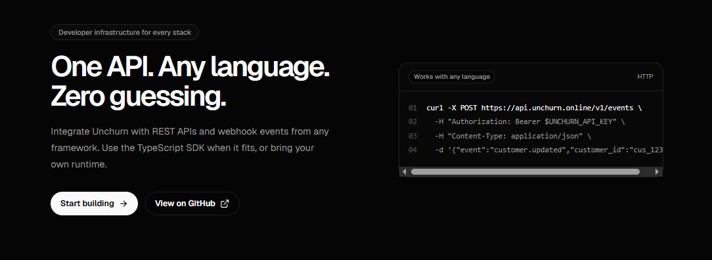

<p align="center">
  
</p>

# Unchurn Developer Portal

This repository powers the Unchurn developer portal: the public landing page, documentation, search, LLM-friendly routes, Open Graph images, sitemap, and Fumadocs content source.

Unchurn is developer-first infrastructure. The portal is designed to explain one workflow clearly: understand the platform, integrate through REST APIs or webhooks from any stack, and use SDKs where they make sense.

## Tech Stack

- Next.js App Router
- React 19
- TypeScript
- Tailwind CSS v4
- Fumadocs UI and Fumadocs MDX
- Bun for dependency management
- Biome for linting and formatting

## Getting Started

Install dependencies:

```bash
bun install
```

Run the development server:

```bash
bun run dev
```

Open http://localhost:3000.

## Scripts

```bash
bun run dev          # Start the local Next.js dev server
bun run build        # Build the production app
bun run start        # Start the production server
bun run types:check  # Generate Fumadocs/Next types and run TypeScript
bun run lint         # Run Biome checks
bun run format       # Format with Biome
```

## Project Structure

| Path | Purpose |
| --- | --- |
| `src/app/(home)` | Developer landing page route group. |
| `src/components/home` | Composable landing page sections. |
| `src/app/docs` | Fumadocs documentation routes. |
| `content/docs` | MDX documentation content and root-folder metadata. |
| `src/app/api/search/route.ts` | Fumadocs search endpoint. |
| `src/app/llms.txt` | LLM index route. |
| `src/app/llms-full.txt` | Full LLM text route. |
| `src/app/llms.mdx/docs` | Per-page markdown route for LLM tools. |
| `src/app/og/docs` | Dynamic Open Graph image route. |
| `src/lib/source.ts` | Fumadocs source loader. |
| `src/lib/layout.shared.tsx` | Shared layout options for Fumadocs layouts. |
| `source.config.ts` | Fumadocs MDX collection configuration. |
| `src/styles/global.css` | Global Tailwind/Fumadocs styles. |

## Documentation Content

Documentation lives in `content/docs` and is organized by Fumadocs root folders:

- `overview`
- `guides`
- `webhooks`
- `api-reference`

The current `content/docs` content is starter material generated with AI. Treat it as scaffolding, not final product documentation. It is expected to change as the real Unchurn API, webhook events, SDKs, and integration guides are written.

Do not edit generated `.source` files manually. They are created by Fumadocs during install/type generation.

## Validation Before Shipping

At minimum, run:

```bash
bun run types:check
```

For code or styling changes, also run:

```bash
bun run lint
bun run build
```

## Contributing

See [CONTRIBUTING](./CONTRIBUTING.md) for the development workflow, pull request rules, repository settings, and security expectations.

## Security

Do not open public issues for vulnerabilities. See [SECURITY](./SECURITY) for the responsible disclosure process.

## License

This project is licensed under the [MIT License](./LICENSE).
